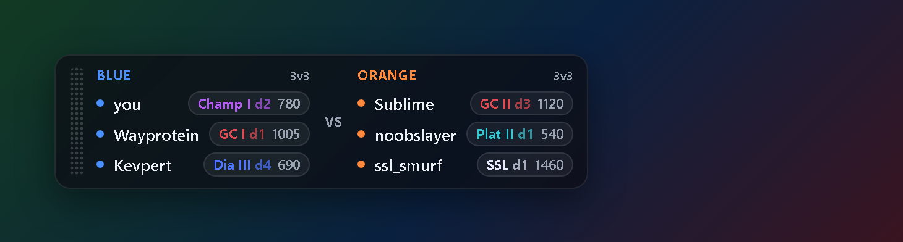

# RL Rank Overlay

[](https://github.com/HilsenFar/rl-rank-overlay/releases)
[](https://github.com/HilsenFar/rl-rank-overlay/releases/latest)

A small, transparent overlay for **Rocket League** that shows every player in
your current match with their competitive rank — your teammates and your
opponents, each with a rank emblem in the tier's colours, division and MMR. It sits on top of the game, hides
itself when the game isn't running, and you can drag it wherever you like.



It is built to be **easy to read**. The whole thing is a few short files:

```
src/
  overlay.mjs        the local process: wires everything together, serves the page
  lib/feed.mjs       reads Rocket League's Stats API and pulls out the lobby roster
  lib/watcher.mjs    asks the rank service for those players' ranks
  lib/statsapi.mjs   switches the game's Stats API feed on if it's off
  public/overlay.html  the glass card you see
host/
  Program.cs         the transparent always-on-top window (WebView2)
```

## How it works

1. Rocket League has a built-in **Stats API** that streams your current match
   over a local socket. `lib/feed.mjs` reads it and extracts the roster: each
   player's name, account id and team.
2. Those account ids go to a shared **rank service** ("the watcher") over one
   HTTPS request. It answers with each player's rank per playlist. That single
   request is the *only* thing this program ever sends anywhere — see
   `lib/watcher.mjs`. There is no account, key or login on your side, and there
   is no analytics or feedback of any kind.
3. `overlay.mjs` serves a tiny page at `http://127.0.0.1:8342/`, and the
   `RLOverlay.exe` window draws it transparently over the game.

The rank service holds one read-only game session on the server so that
thousands of overlays don't each have to. You never see or handle any of that —
you just ask it about a list of players and it tells you their ranks.

## Run it (the easy way)

1. Download the latest release zip from the
   [Releases page](../../releases) and unzip it anywhere.
2. Windows SmartScreen will warn about the unsigned build. Either click "More info" > "Run anyway", or avoid the warning entirely: right-click the zip > Properties > tick **Unblock** before extracting.
3. Double-click **`RLOverlay.exe`** — it starts its own local reader and takes it down again when you quit. (`start.cmd` does the same the long way.)
4. Start Rocket League and queue a match. The overlay appears once you're in a
   lobby, and hides when the game closes.

The release bundles its own Node runtime and the WebView2 window, so there's
nothing to install on a normal Windows 10/11 machine.

> **First run:** the overlay makes sure the game's Stats API feed is switched
> on. If it turns it on for the first time, **restart Rocket League once** so
> the game picks it up.

## Run it from source (for developers)

Requires **Node ≥ 18** and, to build the window, the **.NET SDK**.

```bash
node src/overlay.mjs      # start the reader + page on http://127.0.0.1:8342/
node build.mjs            # build RLOverlay.exe and assemble dist/ + the release zip
node --test               # run the tests
```

You can open `http://127.0.0.1:8342/` in any browser to see the card (it just
won't be transparent — that's what the native window is for), or open
`src/public/overlay.html?demo` directly for a preview with stand-in data and no
game or server needed (that's how the screenshot above was made).

## Settings

All optional, via environment variables:

| Variable | Default | Meaning |
|---|---|---|
| `WATCHER_URL` | `https://collect.gitato.net` | The rank service. `off` disables rank lookups. |
| `PORT` | `8342` | Local page / event-stream port. |
| `STATS_HOST` / `STATS_PORT` | `127.0.0.1` / `49123` | Where the game's Stats API listens. |
| `STATSAPI_INI` | (auto-detected) | Path to `DefaultStatsAPI.ini` if the game lives somewhere unusual. |

## What it does **not** do

- No login, no account, no API key.
- No telemetry, no feedback, no data leaves your machine except the one rank
  lookup to the watcher.
- It does not read or write anything in the game beyond enabling the Stats API
  feed (one line in one config file), which is the same thing the game's own
  companion tools do.

## License

[PolyForm Noncommercial 1.0.0](LICENSE) — free to use and modify for
non-commercial purposes.
